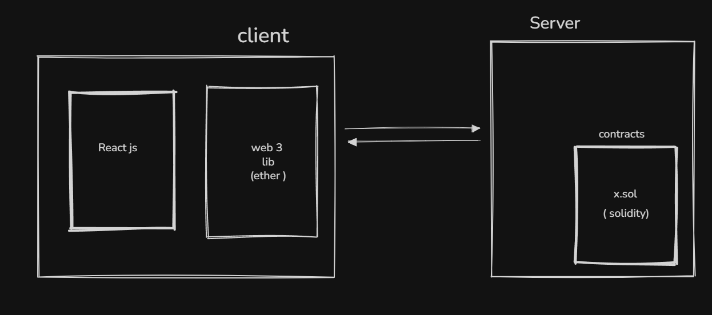
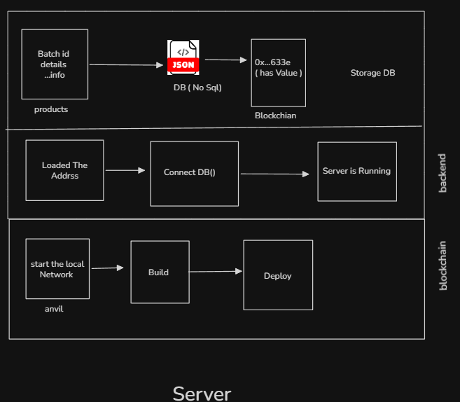
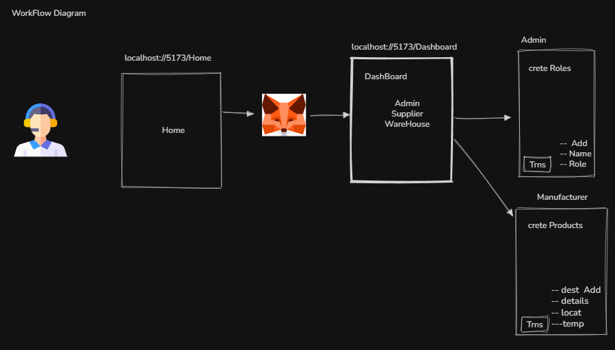

# ColdChain Pro

**Blockchain-Backed Cold Chain Supply Chain Management System**

ColdChain Pro is a production-grade, full-stack supply chain management platform that leverages blockchain immutability to provide tamper-proof tracking, end-to-end temperature monitoring, and verifiable product authenticity across pharmaceutical and perishable cold chains.

---

## Problems with Traditional Blockchain

- **No contract upgrade path.** Smart contracts are deployed without a proxy pattern (e.g., OpenZeppelin Transparent or UUPS Proxy). Any bug fix or feature change requires redeployment and manual migration of state.
- **Single admin key.** The deploying address holds full admin authority. There is no multi-signature governance, timelock, or admin rotation mechanism.
- **No on-chain event indexing.** The application polls the blockchain directly rather than indexing events via a subgraph (e.g., The Graph), creating performance bottlenecks.
- **No chain reorganisation handling.** The backend does not account for chain reorgs on public networks, which could result in state divergence.

---

## Table of Contents

- [Overview](#overview)
- [Architecture](#architecture)
- [Tech Stack](#tech-stack)
- [Project Structure](#project-structure)
- [Prerequisites](#prerequisites)
- [Local Development Setup](#local-development-setup)
- [Smart Contract Deployment](#smart-contract-deployment)
- [Environment Configuration](#environment-configuration)
- [Running the Application](#running-the-application)
- [MetaMask Configuration](#metamask-configuration)
- [End-to-End Testing Walkthrough](#end-to-end-testing-walkthrough)
- [API Reference](#api-reference)
- [Frontend Routes](#frontend-routes)
- [Known Issues & Limitations](#known-issues--limitations)
- [Troubleshooting](#troubleshooting)
- [Security Notice](#security-notice)
- [License](#license)

---

## Overview

### What It Does

ColdChain Pro enables supply chain stakeholders — manufacturers, suppliers, warehouses, and retailers — to track product batches from origin to shelf with cryptographic guarantees. Every ownership transfer and environmental condition log is recorded on-chain, while rich metadata and search capabilities are served through an off-chain MongoDB backend.

### Key Capabilities

- **Role-based access control** enforced at the smart contract layer
- **Immutable ownership transfers** following strict chain-of-custody rules
- **Real-time temperature monitoring** with automatic out-of-range alerting
- **SHA-256 product integrity hashing** with on-chain verification
- **Public product authentication** — no wallet required for consumers
- **Hybrid on-chain/off-chain architecture** balancing trust, speed, and query flexibility

---

## Architecture

```
┌──────────────────────────────────────────────────────────┐
│                        FRONTEND                          │
│         React 19 + Vite + Tailwind CSS + ethers.js v6   │
│         MetaMask ← wallet-based authentication           │
└──────────────┬────────────────────────┬──────────────────┘
               │ REST API calls          │ Direct contract calls
               ▼                        ▼
┌─────────────────────────┐   ┌──────────────────────────┐
│        BACKEND          │   │    BLOCKCHAIN (Anvil /   │
│   Node.js + Express 5   │   │     EVM-compatible)      │
│   MongoDB + Mongoose    │   │                          │
│   SHA-256 hashing       │   │   RoleManager.sol        │
│   Off-chain metadata    │   │   ProductBatch.sol       │
│   Search & audit logs   │   │   ColdChainMonitor.sol   │
└─────────────────────────┘   └──────────────────────────┘
```

**Design rationale — why hybrid?**

| Concern | Blockchain | MongoDB |
|---|---|---|
| Ownership & roles | ✅ On-chain (immutable) | — |
| Product hashes | ✅ On-chain (tamper-proof) | — |
| Rich metadata & search | — | ✅ Off-chain (fast, flexible) |
| Temperature logs | Hash committed on-chain | Full data in MongoDB |
| Consumer queries | — | ✅ Off-chain (no gas cost) |

---

## Tech Stack

| Layer | Technology | Version |
|---|---|---|
| Smart Contracts | Solidity + Foundry | `^0.8.x` |
| Local Blockchain | Anvil (Foundry) | latest |
| Frontend | React + Vite | `19.x` / `5.x` |
| Styling | Tailwind CSS | `v4` |
| Blockchain Client | ethers.js | `v6` |
| Backend | Node.js + Express | `18+` / `5.x` |
| Database | MongoDB + Mongoose | `7.x` |
| Wallet | MetaMask | latest |

---

## Project Structure

```
Supply-chain-Mngmnt/
├── blockchain/                  # Foundry project — smart contracts
│   ├── src/
│   │   ├── access/
│   │   │   └── RoleManager.sol          # Role assignment & validation
│   │   ├── products/
│   │   │   └── ProductBatch.sol         # Batch creation & ownership transfers
│   │   └── tracking/
│   │       └── ColdChainMonitor.sol     # Cumulative integrity hash logging
│   ├── script/
│   │   └── Deploy.s.sol                 # Deployment script
│   └── test/                            # Foundry unit tests
│
├── backend/                     # Express API server
│   └── src/
│       ├── config/
│       │   └── db.js                    # MongoDB connection
│       ├── models/                      # Mongoose schemas
│       ├── controllers/                 # Route handlers
│       ├── routes/                      # API route definitions
│       ├── services/                    # Business logic layer
│       └── utils/
│           └── hashUtil.js              # SHA-256 hashing utilities
│
├── client/                      # React frontend
│   └── src/
│       ├── pages/                       # Route-level components
│       ├── components/                  # Shared UI components
│       ├── context/
│       │   └── WalletContext.jsx        # MetaMask connection state
│       ├── contracts/                   # ABIs + deployed addresses
│       └── services/                    # API + contract call abstractions
│
└── docs/
    └── README.md
```

---

## Prerequisites

Ensure the following are installed before proceeding:

| Tool | Version | Install |
|---|---|---|
| Node.js | `v18+` | https://nodejs.org |
| MongoDB Community | any | https://www.mongodb.com/try/download/community |
| Foundry | latest | https://getfoundry.sh |
| MetaMask | latest | Chrome Web Store |
| Git | any | https://git-scm.com |

Verify your environment:

```bash
node --version     # must be v18 or higher
mongod --version
forge --version
anvil --version
```

---

## Local Development Setup

### 1. Install dependencies

```bash
# Backend
cd backend && npm install

# Frontend
cd ../client && npm install
```

---

### 2. Start MongoDB

Open a dedicated terminal and run:

```bash
mongod
```

MongoDB will listen on `localhost:27017`. Leave this terminal running throughout development.

---

### 3. Start Anvil (local EVM node)

Open another terminal:

```bash
anvil
```

Anvil will print pre-funded test accounts. **Copy and save these — you will need them shortly.**

```
Available Accounts
==================
(0) 0xf39Fd6e51aad88F6F4ce6aB8827279cffFb92266   ← Admin
(1) 0x70997970C51812dc3A010C7d01b50e0d17dc79C8   ← Manufacturer
(2) 0x3C44CdDdB6a900fa2b585dd299e03d12FA4293BC   ← Supplier
(3) 0x90F79bf6EB2c4f870365E785982E1f101E93b906   ← Warehouse
(4) 0x15d34AAf54267DB7D7c367839AAf71A00a2C6A65   ← Retailer

Private Keys (local dev only — never use on mainnet)
==================
(0) 0xac0974bec39a17e36ba4a6b4d238ff944bacb478cbed5efcae784d7bf4f2ff80
(1) 0x59c6995e998f97a5a0044966f0945389dc9e86dae88c7a8412f4603b6b78690d
(2) 0x5de4111afa1a4b94908f83103eb1f1706367c2e68ca870fc3fb9a804cdab365a
(3) 0x7c852118294e51e653712a81e05800f419141751be58f605c371e15141b007a6
(4) 0x47e179ec197488593b187f80a00eb0da91f1b9d0b13f8733639f19c30a34926a
```

> **Leave this terminal running.**

---

## Smart Contract Deployment

Open a new terminal in the `blockchain/` directory:

```bash
cd blockchain

# Compile
forge build

# Run tests
forge test -vvv

# Deploy to local Anvil
forge script script/Deploy.s.sol --broadcast --rpc-url http://127.0.0.1:8545
```

The output will include the deployed contract addresses:

```
RoleManager deployed at:      0x5FbDB2315678afecb367f032d93F642f64180aa3
ProductBatch deployed at:     0xe7f1725E7734CE288F8367e1Bb143E90bb3F0512
ColdChainMonitor deployed at: 0x9fE46736679d2D9a65F0992F2272dE9f3c7fa6e0
```

**Copy all three addresses** — they are required in the next step.

> These addresses are deterministic for Anvil's default state. If you restart Anvil and redeploy, you will get the same addresses — unless you modify deployment order or nonce.

---

## Environment Configuration

### `backend/.env`

```env
PORT=5000
MONGODB_URI=mongodb://localhost:27017/coldchain
RPC_URL=http://127.0.0.1:8545

# Anvil Account 0 — Admin (local dev only)
PRIVATE_KEY=0xac0974bec39a17e36ba4a6b4d238ff944bacb478cbed5efcae784d7bf4f2ff80

ROLE_MANAGER_ADDRESS=0x5FbDB2315678afecb367f032d93F642f64180aa3
PRODUCT_BATCH_ADDRESS=0xe7f1725E7734CE288F8367e1Bb143E90bb3F0512
COLD_CHAIN_MONITOR_ADDRESS=0x9fE46736679d2D9a65F0992F2272dE9f3c7fa6e0
```

### `client/.env`

```env
VITE_API_URL=http://localhost:5000

VITE_ROLE_MANAGER_ADDRESS=0x5FbDB2315678afecb367f032d93F642f64180aa3
VITE_PRODUCT_BATCH_ADDRESS=0xe7f1725E7734CE288F8367e1Bb143E90bb3F0512
VITE_COLD_CHAIN_MONITOR_ADDRESS=0x9fE46736679d2D9a65F0992F2272dE9f3c7fa6e0
```

> Vite does not hot-reload `.env` changes. Restart `npm run dev` after any edit.

---

## Running the Application

### Start the backend

```bash
cd backend
npm run sync-chain
npm run dev
```

Expected output:

```
✅ MongoDB Connected: localhost
🚀 Server running on http://localhost:5000
```

Verify:

```bash
curl http://localhost:5000/
# {"status":"Cold Chain Backend Running ✅"}
```

### Start the frontend

```bash
cd client
npm run dev
```

Opens at: **http://localhost:5173**

---

## MetaMask Configuration

### Add Anvil as a custom network

| Field | Value |
|---|---|
| Network Name | `Anvil Local` |
| RPC URL | `http://127.0.0.1:8545` |
| Chain ID | `31337` |
| Currency Symbol | `ETH` |

### Import test accounts

In MetaMask → avatar → **Import Account** → paste each private key from the Anvil output. Label them `Admin`, `Manufacturer`, `Supplier`, `Warehouse`, and `Retailer` for clarity.

---

## End-to-End Testing Walkthrough

### Phase 1 — Create stakeholders (Admin)

1. Switch MetaMask to the **Admin** account (Account 0)
2. Navigate to `http://localhost:5173/admin` and connect wallet
3. Register the following stakeholders:

| MetaMask Account | Name | Role |
|---|---|---|
| Account 1 | Pharma MFG Ltd | MANUFACTURER |
| Account 2 | Fast Supplier Co | SUPPLIER |
| Account 3 | Cold Warehouse | WAREHOUSE |
| Account 4 | City Retail | RETAILER |

Each registration submits a blockchain transaction. Confirm each in MetaMask.

---

### Phase 2 — Create a product batch (Manufacturer)

1. Switch MetaMask to **Account 1**
2. Navigate to `http://localhost:5173/manufacturer`
3. Fill in the **Create Batch** form:

| Field | Example |
|---|---|
| Batch ID | `BATCH-001` |
| Product Name | `COVID Vaccine` |
| Origin | `Mumbai, India` |
| Min Temperature (°C) | `2` |
| Max Temperature (°C) | `8` |
| Manufacturing Date | today |
| Expiry Date | 6 months out |

4. Click **Create on Blockchain** and confirm in MetaMask.

---

### Phase 3 — Transfer through the supply chain

Transfers must follow the enforced chain-of-custody order:

```
MANUFACTURER → SUPPLIER → WAREHOUSE → RETAILER
```

Any out-of-order transfer will be **rejected by the smart contract**.

For each transfer:
1. Switch MetaMask to the current owner's account
2. Navigate to their dashboard and use the **Transfer** tab
3. Enter the recipient's wallet address and confirm

---

### Phase 4 — Log cold chain conditions

From any stakeholder dashboard, use the **Log Condition** tab to submit:

- Temperature reading
- GPS/location
- Seal integrity status

If the logged temperature falls outside the product's registered safe range, a **temperature breach alert is automatically triggered** and flagged on all subsequent views of that batch.

---

### Phase 5 — Public product verification (no wallet required)

1. Open an incognito window to confirm MetaMask is not involved
2. Navigate to `http://localhost:5173/search`
3. Search by batch ID or product name (e.g. `BATCH-001` or `COVID`)
4. The product detail view shows:
   - **✅ AUTHENTIC** or **❌ TAMPERED** — based on on-chain hash comparison
   - Full custody transfer history
   - Temperature log timeline with safety status per entry

---

## API Reference

### Stakeholders

| Method | Endpoint | Description |
|---|---|---|
| `POST` | `/api/stakeholders` | Register a new stakeholder |
| `GET` | `/api/stakeholders` | List all stakeholders |
| `GET` | `/api/stakeholders/:wallet` | Get stakeholder by wallet address |

### Products

| Method | Endpoint | Description |
|---|---|---|
| `POST` | `/api/products/create` | Create a product batch + generate hash |
| `GET` | `/api/products/:batchId` | Get product by batch ID |
| `GET` | `/api/products/manufacturer/:wallet` | Get all products by manufacturer |
| `GET` | `/api/products/owner/:wallet` | Get all products by current owner |

### Transfers

| Method | Endpoint | Description |
|---|---|---|
| `POST` | `/api/transfers/record` | Record a custody transfer |
| `GET` | `/api/transfers/:batchId` | Get full transfer history |

### Monitoring

| Method | Endpoint | Description |
|---|---|---|
| `POST` | `/api/monitoring/log` | Submit a condition log entry |
| `GET` | `/api/monitoring/:batchId` | Get all logs for a batch |
| `GET` | `/api/monitoring/alerts/:batchId` | Get only out-of-range logs |

### Verification & Search

| Method | Endpoint | Description |
|---|---|---|
| `GET` | `/api/verify/:batchId` | Verify product authenticity against on-chain hash |
| `GET` | `/api/search?query=` | Full-text product search |
| `GET` | `/api/search/product/:batchId` | Full product detail view for consumers |

---

## Frontend Routes

| Route | Page | Wallet Required |
|---|---|---|
| `/` | Landing page | No |
| `/search` | Public product search & verification | No |
| `/admin` | Admin dashboard — stakeholder management | Yes (Admin only) |
| `/manufacturer` | Manufacturer dashboard | Yes (MANUFACTURER role) |
| `/supplier` | Supplier dashboard | Yes (SUPPLIER role) |
| `/warehouse` | Warehouse dashboard | Yes (WAREHOUSE role) |
| `/retailer` | Retailer dashboard | Yes (RETAILER role) |

---

## Smart Contract Summary

| Contract | Responsibility |
|---|---|
| `RoleManager.sol` | Assigns and validates roles (MANUFACTURER, SUPPLIER, WAREHOUSE, RETAILER) on a per-wallet basis |
| `ProductBatch.sol` | Stores product integrity hashes on-chain; enforces valid custody transfer sequences |
| `ColdChainMonitor.sol` | Maintains a cumulative integrity hash updated with each monitoring log submission |

**Enforced transfer rules:**

```
MANUFACTURER → SUPPLIER   ✅  allowed
SUPPLIER     → WAREHOUSE  ✅  allowed
WAREHOUSE    → RETAILER   ✅  allowed
Any other sequence        ❌  transaction reverts
```

---

## Known Issues & Limitations

The following are known limitations at the current stage of development. They are documented here for transparency and prioritised for future milestones.

### Blockchain & Contract Layer

- **No contract upgrade path.** Smart contracts are deployed without a proxy pattern (e.g. OpenZeppelin Transparent or UUPS Proxy). Any bug fix or feature change requires redeployment and manual migration of state. A proxy-based upgrade system should be implemented before any production deployment.

- **Single admin key.** The deploying address holds full admin authority. There is no multi-signature governance, timelock, or admin rotation mechanism. Compromise of the admin private key would allow unconstrained role assignments.

- **No on-chain event indexing.** The application polls the blockchain directly rather than indexing events via a subgraph (e.g. The Graph) or event listener service. This creates performance bottlenecks at scale and adds latency to real-time monitoring views.

- **No chain reorganisation handling.** The backend does not account for chain reorgs on public networks. Transaction confirmation depth is not validated before recording state in MongoDB, which could result in state divergence on live networks.

### Backend

- **No authentication on the REST API.** All API endpoints are currently open. Any caller can submit logs, record transfers, or query data without presenting a wallet signature or session token. Role enforcement exists only at the smart contract level, not at the API layer.

- **No rate limiting.** The backend has no request throttling. This makes it susceptible to abuse, resource exhaustion, and denial-of-service conditions in any network-accessible deployment.

- **MongoDB and blockchain state can diverge.** If a blockchain write succeeds but the subsequent MongoDB write fails (or vice versa), the two data stores will be out of sync. There is currently no reconciliation or retry mechanism to detect and correct this.

- **No input sanitisation or validation layer.** API inputs are not validated beyond basic Mongoose schema enforcement. Malformed or adversarial inputs are not rejected early and could cause unexpected behaviour in downstream processing.

- **Hardcoded Anvil private key in `.env` template.** The example `.env` uses Anvil's well-known test key. If accidentally committed or deployed with a real network URL, this represents a critical security vulnerability.

### Frontend

- **No graceful MetaMask error handling.** If the user rejects a transaction, has the wrong network selected, or MetaMask is unavailable, errors surface as raw console exceptions rather than user-friendly messages.

- **No wallet session persistence.** Refreshing the page disconnects the wallet. The user must reconnect on every page load. A persistent connection state (using `localStorage` or WalletConnect) would significantly improve UX.

- **Role access control is UI-only.** Dashboard routes check the connected wallet's role via a frontend context check, not a protected route backed by server-side verification. A user who manually navigates to `/manufacturer` with an invalid account will see the dashboard UI before any contract call fails.

- **No loading skeletons or optimistic UI.** Blockchain transactions can take several seconds. There are no loading indicators or optimistic state updates, leading to unresponsive-feeling interactions during confirmation waits.

### Testing

- **No integration or end-to-end tests.** Only Foundry unit tests exist for the smart contracts. There are no backend API tests (e.g. using Supertest) and no E2E browser tests (e.g. using Playwright or Cypress) covering the full stack.

- **No CI/CD pipeline.** There is no automated test runner or deployment workflow configured. All validation is currently manual.

---

## Troubleshooting

| Symptom | Resolution |
|---|---|
| `anvil: address already in use` | Anvil is already running. Use the existing instance or kill the process on port `8545`. |
| `MongoDB connection error` | Start `mongod` in a dedicated terminal. Confirm it is listening on port `27001`. |
| Contract address shows `PASTE_AFTER_DEPLOY` | Complete Step 4 (deploy contracts) and fill both `.env` files with the output addresses. |
| MetaMask: `Wrong Network` | In MetaMask, switch to `Anvil Local` (Chain ID `31337`). |
| `Not a Manufacturer` / role error | Confirm you have imported the correct private key in MetaMask and that the Admin has registered this wallet with the correct role. |
| Frontend not reflecting `.env` changes | Vite requires a full restart after `.env` edits: `Ctrl+C`, then `npm run dev`. |
| Transaction pending indefinitely | Anvil may have been restarted, causing a nonce mismatch. In MetaMask: Settings → Advanced → **Reset Account**. |
| MongoDB and blockchain state out of sync | Drop the `coldchain` MongoDB database and restart. Redeploy contracts if needed for a clean slate. |

---

## Security Notice

> **This project is for educational and development purposes only.**

The following practices are intentional for local development convenience but are **unsafe for any production or publicly accessible deployment**:

- Anvil test private keys are committed to `.env` templates. **Never use these keys on a live network.**
- The REST API has no authentication, authorisation middleware, or rate limiting.
- The admin role is held by a single externally owned account with no multi-sig protection.
- MongoDB is configured without authentication.

Before any production use, a comprehensive security audit — covering both the smart contracts and the backend API — is required.

---

## License

MIT — for educational and development purposes only.

## Images

### Hld.png


### Server.png


### workflow.png
